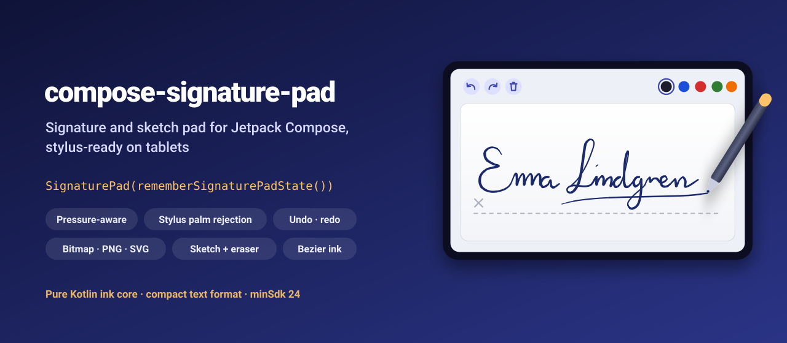
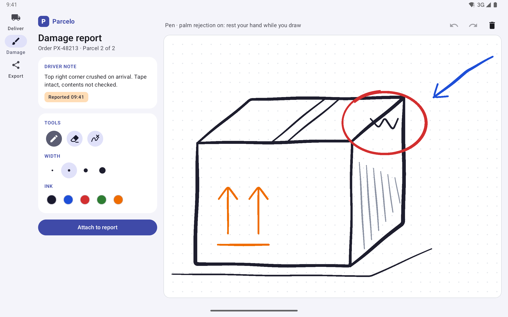
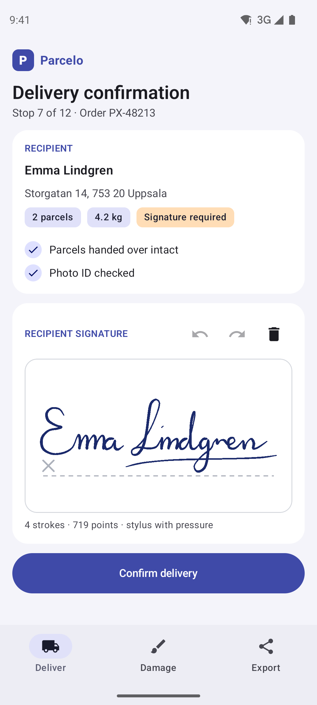
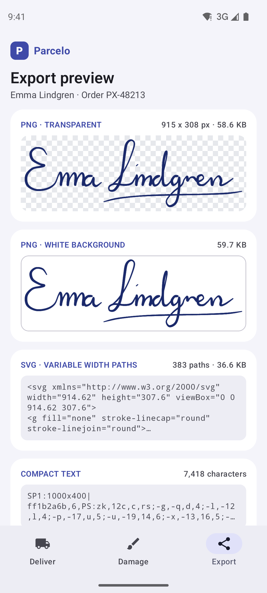
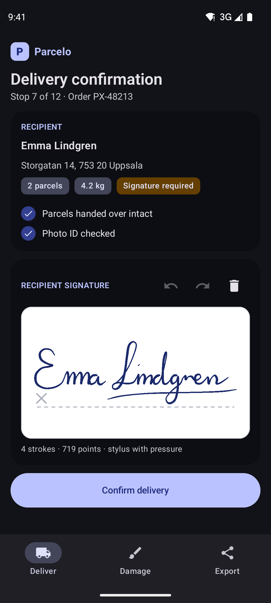
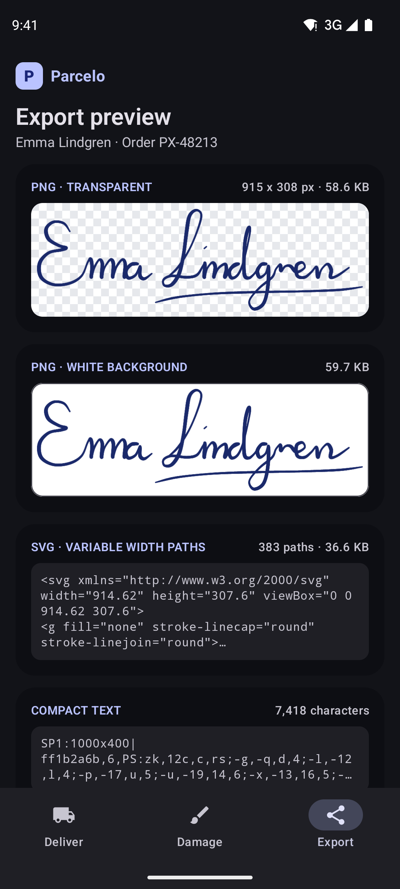
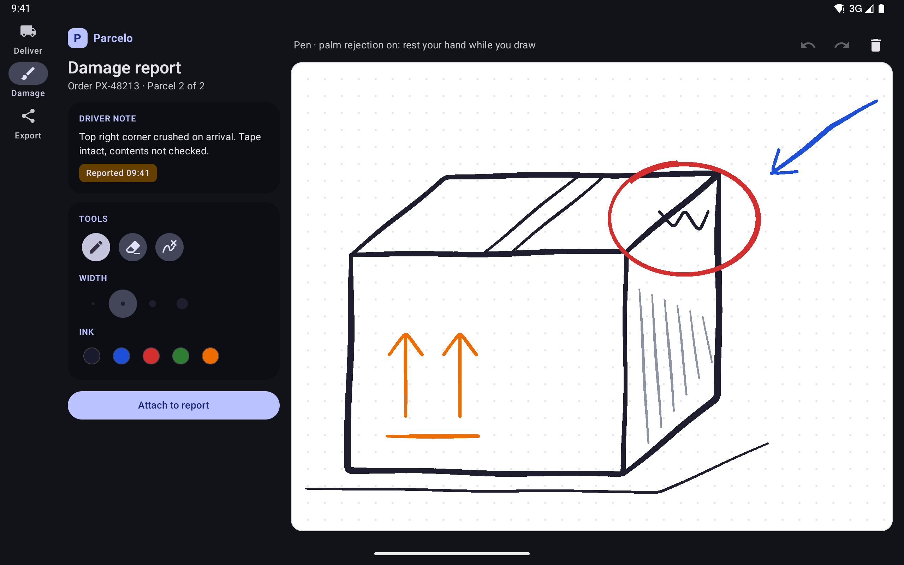

<p align="center">
  
</p>

<p align="center">
  <a href="https://github.com/halilozel1903/compose-signature-pad/actions/workflows/ci.yml"></a>
  <a href="https://jitpack.io/#halilozel1903/compose-signature-pad"></a>
  
  
  
  
  <a href="LICENSE"></a>
</p>

**compose-signature-pad** is a signature and sketch pad for Jetpack Compose that feels like ink. Strokes are smoothed with quadratic Bezier curves and get thinner when you write fast and heavier when you press a stylus harder. It works with fingers on phones and with a stylus on tablets, including palm rejection and the eraser end of the pen. Undo, redo and clear are built in, and the result exports to an `ImageBitmap`, an Android `Bitmap`, PNG bytes, an SVG document or a compact text form you can store in a database column. The ink model is a small pure Kotlin module with unit tests.

```kotlin
val state = rememberSignaturePadState()

SignaturePad(state, Modifier.fillMaxWidth().height(200.dp))   // baseline, "×" and "Sign here" until signed
SignaturePadToolbar(state)                                    // undo, redo, clear

Button(onClick = { upload(state.toPngBytes(background = Color.White, trimPadding = 16f)) }, enabled = !state.isEmpty) {
    Text("Confirm delivery")
}
```

## Screenshots

Captured from the sample app (Parcelo, a fictional courier app) on Android emulators by CI. There is no stylus on CI, so the scenes load pre-recorded ink with real pressure and timing.

**Tablet, sketch pad:** a damage report drawn with a stylus, with pen, eraser and stroke eraser, widths and ink colors.



| Phone, signed delivery | Phone, export preview | Signed delivery, dark | Export preview, dark |
| :---: | :---: | :---: | :---: |
|  |  |  |  |



## Features

- **Ink that looks like ink**: points are smoothed with quadratic Bezier midpoints, and the width follows speed (fast strokes are thinner) and stylus pressure. Pick a `PenConfig`: `Default`, `Fountain` (strong contrast, great for signatures), `PressureOnly` (pencil-like) or `Uniform` (marker), or tune your own.
- **Stylus ready**: pressure, the stylus tip and the eraser end (`PointerType.Eraser` erases on its own), historical points for smooth fast strokes, and opt-in **palm rejection**: fingers are ignored while a stylus is in use, and a stroke a palm started is cancelled when the pen touches down.
- **`SignaturePad`**: paper colored pad with a dashed baseline, an "×" mark and a "Sign here" hint that goes away once someone signs.
- **`SketchPad`**: dot grid, square grid or plain paper, with a pen, a pixel **eraser** and a **stroke eraser** that removes whole strokes.
- **Undo, redo and clear** for every stroke, erase and clear (clearing can be undone too), with a configurable number of steps.
- **Toolbar composables**: `UndoButton`, `RedoButton`, `ClearButton`, `PenWidthPicker`, `PenColorPicker`, `ToolPicker`, or all of them in `SignaturePadToolbar`. Icons are built in; no icon dependency.
- **Export**: `ImageBitmap`, `Bitmap` or PNG bytes with a transparent or white background, trimmed to the ink with padding and scaled for print; SVG with variable width paths (eraser strokes become masks); a compact text form for storage.
- **Survives rotation and process death**: `rememberSignaturePadState` saves strokes, pen color, width and tool.
- **Pure Kotlin core** (`compose-signature-pad-core`): stroke model, smoothing, width model, Ramer-Douglas-Peucker simplification, bounds and trimming, undo history, hit testing, palm rejection, text format and SVG export, unit tested and usable on a server.

## Installation

Add JitPack to `settings.gradle.kts`:

```kotlin
dependencyResolutionManagement {
    repositories {
        google()
        mavenCentral()
        maven("https://jitpack.io")
    }
}
```

Then the dependency:

```kotlin
dependencies {
    implementation("com.github.halilozel1903.compose-signature-pad:compose-signature-pad:1.0.0")
    // Pure Kotlin ink model only (to render or validate signatures on a JVM backend):
    // implementation("com.github.halilozel1903.compose-signature-pad:compose-signature-pad-core:1.0.0")
}
```

> The build is also set up for Maven Central (`io.github.halilozel1903:compose-signature-pad`) via the vanniktech publish plugin.

## Usage

**Signature field**

```kotlin
val state = rememberSignaturePadState(
    penColor = Color(0xFF1B2A6B),
    penWidth = 2.5.dp,
    penConfig = PenConfig.Fountain,
)

Column {
    Row(verticalAlignment = Alignment.CenterVertically) {
        Text("Recipient signature", Modifier.weight(1f))
        UndoButton(state)
        RedoButton(state)
        ClearButton(state)
    }
    SignaturePad(
        state = state,
        hint = "Sign here",               // null for no hint
        showBaseline = true,
        palmRejection = isTablet,         // ignore a resting palm while a stylus writes
        modifier = Modifier.fillMaxWidth().height(200.dp),
        onStrokeFinished = { stroke -> analytics.signed(stroke.toolType) },
    )
}
```

`state.isEmpty`, `state.isDrawing`, `state.canUndo`, `state.canRedo` and `state.strokes` are Compose state, so a "Confirm" button can follow them.

**Export**

```kotlin
val png: ByteArray = state.toPngBytes(background = Color.White, trimPadding = 16f)   // for the upload
val image: ImageBitmap = state.toImageBitmap()                                      // transparent, canvas size
val bitmap: Bitmap = state.toBitmap(trimPadding = 8f, scale = 2f)                    // sharper, for a PDF
val svg: String = state.toSvg()                                                      // variable width paths
val text: String = state.encode()                                                    // "SP1:1036x525|ff1b2a6b,6.56,PS:..."

state.load(text)                                    // back on the pad
state.load(signature, fitToCanvas = true)           // scaled and centered on this pad
```

The same exports exist on a `Signature` (`signature.toImageBitmap(...)`, `toBitmap`, `toPngBytes`, `toSvg()`, `encode()`), for example to render a stored signature on another screen.

**Sketch pad with tools**

```kotlin
val sketch = rememberSignaturePadState(penWidth = 3.dp)

Column {
    SignaturePadToolbar(sketch, showTools = true, showWidths = true, showColors = true)
    SketchPad(
        state = sketch,
        paper = SketchPaper.Dots,          // Plain, Dots or Grid; not part of exports
        palmRejection = true,              // on by default for sketching
        modifier = Modifier.fillMaxSize(),
    )
}

sketch.tool = DrawingTool.Eraser           // Pen, Eraser or StrokeEraser
sketch.eraserWidth = 32.dp
sketch.stylusEraserTool = DrawingTool.StrokeEraser   // what the pen's eraser end does (null: same as tool)
```

**Pen feel**

```kotlin
state.penConfig = PenConfig(
    minWidthFactor = 0.4f,       // width factor for fast, light strokes
    maxWidthFactor = 1.8f,       // ...and for slow, heavy ones
    velocityForMinWidth = 4f,    // px per ms at which the stroke is thinnest
    velocityWeight = 0.7f,       // how much speed matters, 0..1
    pressureWeight = 0.8f,       // how much stylus pressure matters, 0..1
    smoothing = 0.5f,            // how much of the previous width is kept, 0 until 1
)
```

Fingers that report a constant pressure are drawn from speed alone; a stylus (or input whose pressure varies) mixes in pressure.

**Colors**

The pad is paper: white with dark ink in light and dark themes alike, so what people see is what gets exported. Change it with `SignaturePadDefaults.colors(background = ..., border = ..., baseline = ..., hint = ..., grid = ...)`.

## The core module

`compose-signature-pad-core` has no Android or Compose dependency. The pads are built on it, and you can use it to validate, render or convert signatures on a JVM backend:

```kotlin
val stroke = Stroke(
    points = listOf(
        StrokePoint(x = 12.3f, y = 4.5f, pressure = 0.5f, timeMillis = 1000, toolType = ToolType.Stylus),
        StrokePoint(x = 13.3f, y = 4.0f, pressure = 0.52f, timeMillis = 1008, toolType = ToolType.Stylus),
    ),
    color = 0xFF1A1A2E.toInt(),
    width = 6f,
)
val signature = Signature(listOf(stroke), width = 300f, height = 120f)

signature.encode()                       // "SP1:300x120|ff1a1a2e,6,PS:3f,19,1e,rs;a,-5,1g,8"
Signature.decode(text)                   // and back
signature.trim(padding = 16f)            // canvas cropped to the ink
signature.fitInto(600f, 200f)            // scaled and centered on another canvas
signature.simplify(tolerance = 0.8f)     // Ramer-Douglas-Peucker, fewer points
signature.toSvg(SvgOptions(background = 0xFFFFFFFF.toInt(), trimPadding = 16f))

SvgExporter.pathData(Stroke(listOf(StrokePoint(0f, 0f), StrokePoint(10f, 0f), StrokePoint(10f, 10f))))
// "M0 0 L5 0 Q10 0 10 5 L10 10"
```

| API | What it does |
| --- | --- |
| `StrokePoint`, `ToolType`, `Stroke`, `StrokeKind`, `Signature` | Points with x, y, pressure, time and tool; strokes with color, width and pen or eraser; a drawing with its canvas size |
| `StrokeSmoothing`, `PathSegment`, `StrokeSample` | Quadratic Bezier midpoint smoothing, and samples along the curve with interpolated widths |
| `PenConfig`, `StrokeWidths` | Velocity and pressure based width with presets |
| `Simplification` | Ramer-Douglas-Peucker point reduction |
| `BoundingBox`, `Signature.trim`, `Signature.fitInto` | Ink bounds with stroke widths, trimming and fitting |
| `StrokeHistory` | Immutable undo and redo with a step limit; clear is undoable |
| `StrokeHitTest` | Strokes near a point, for the stroke eraser |
| `PalmRejection` | Ignores fingers while a stylus is active (opt-in), with a grace period between words |
| `SignatureCodec` | The compact, JSON free text form (`SP1:...`), rounded to 0.1 px |
| `SvgExporter`, `SvgOptions` | SVG with variable or uniform width paths, background, trimming and eraser masks |

## Sample app

The `sample` module is Parcelo, a fictional courier app: the Deliver tab is a delivery confirmation with a signature pad, the Damage tab a sketch pad for damage reports (tools on the side on tablets), and the Export tab shows the signature as transparent and white PNGs, SVG and the compact text form.

CI has no stylus and adb cannot draw with pressure, so the sample opens a screen with pre-recorded ink from an intent extra (used by `scripts/screenshots.sh`). The cursive signature is generated from a hand-tuned list of control points with a Catmull-Rom spline, heavier pressure on downstrokes and slower timing in tight turns:

```bash
./gradlew :sample:installDebug
adb shell am start -n io.github.halilozel1903.signaturepad.sample/.MainActivity --es scene signature
```

`scene` is one of `signature` (the signed delivery form), `sketch` (the damage sketch) or `export` (the export preview). CI captures `sketch` on a Pixel Tablet emulator in landscape and `signature` and `export` on a Pixel 7, in light and dark mode, checks each capture for the screen's text and fails on blank images. Without a scene the pads start empty: sign with a finger, or with a stylus on a tablet.

## Project structure

| Module | What it is |
| --- | --- |
| `signaturepad-core` | Pure Kotlin: stroke model, smoothing, width, simplification, bounds, undo history, hit testing, palm rejection, text format, SVG export. Published as `compose-signature-pad-core` |
| `signaturepad` | Compose: `rememberSignaturePadState`, `SignaturePad`, `SketchPad`, toolbar composables, bitmap and PNG export. Published as `compose-signature-pad` |
| `sample` | Parcelo, a courier app for phones and tablets, with screenshot scenes |

## Tech stack

Kotlin 2.4 · AGP 9.4 with built-in Kotlin · Gradle 9.6 · Jetpack Compose (BOM 2026.09) · Material 3 · `pointerInput` with pressure, `PointerType.Stylus` and historical points · `Canvas` with an offscreen layer for the eraser · `CanvasDrawScope` for export · GitHub Actions with Android emulators

## License

MIT. See [LICENSE](LICENSE).
